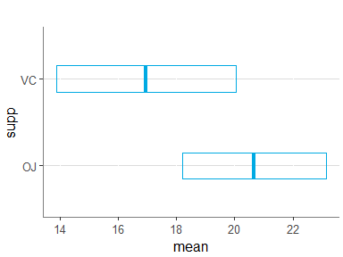
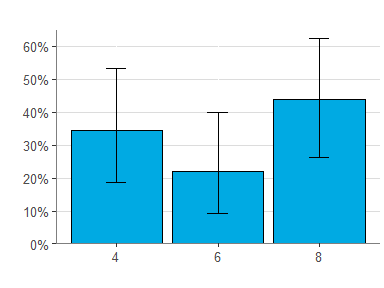

<!-- README.md is generated from README.Rmd. Please edit that file -->

# jsmp

<br>

This package does variety of things I find useful when working with R
Tidyverse:

-   [Import commonly used packages](#imported-packages)
-   [Changes the default ggplot theme](#custom-ggplot-theme)
-   [Overrides dplyr::summarise to remove leftover
    grouping](#general-functions)
-   [Contains various functions for use with ggplot](#ggplot-functions)
-   [Contains various functions for use in tidy
    code](#general-functions)

<br>

## Installation

`devtools::install_github("ymer/jsmp")`

<br>

## Custom ggplot theme

<!-- -->

<br>

## ggplot functions

-   `gg_hist_percent` : Draws a histogram with y-axis as a percentage

-   `gg_legend_remove` : Removes the legend

-   `gg_legend_notitle` : Removes the legend title

-   `gg_legend_bottom` : Moves the legend to the bottom of the plot

-   `gg_loess_line` : Plots a locally weighed regression line

-   `gg_regression_line` : Plots a regression line

-   `gg_x_remove` : Removes the x-axis

-   `gg_x_rotate` : Rotates x-axis labels 45°

-   `gg_x_wrap` : Wraps text on x-axis labels

-   `gg_y_big` : Changes the y-axis to avoid scientific notation for big
    numbers

-   `gg_y_percent` : Changes the y-axis to percentage

-   `gg_y_percent_zero` : Changes the y-axis to percentage, and adjusts
    the y-axis to start at 0.

-   `gg_y_remove` : Removes the y-axis

-   `gg_y_zero` : Adjusts the y-axis to start at exactly 0

<br>

## General functions

-   `summarise` : Overrides the standard summarise function, so that
    leftover grouping is dropped after summarising

``` r
mtcars |> 
   group_by(am, gear) |> 
   dplyr::summarise(mean_mpg = mean(mpg)) |> 
   group_vars()
#> [1] "am"
```

``` r
mtcars |> 
   group_by(am, gear) |> 
   summarise(mean_mpg = mean(mpg)) |> 
   group_vars()
#> character(0)
```

-   `%notin%` : As `%in%` but exclusionary

-   `d` : Formats table (using `gt` as base)

-   `ci_means` : Finds the means and confidence intervals

``` r
ToothGrowth |> 
   group_by(supp) |> 
   ci_means(len) |> 
   ggplot(aes(y = supp, x = mean)) +
   geom_crossbar(aes(xmin = ci.lower, xmax = ci.upper), width = 0.3, size = 0.7, color = c1)
```

<!-- -->

-   `ci_proportions` : Finds the proportions and confidence intervals

``` r
mtcars |> 
   mutate(cyl = as.character(cyl)) |> 
   count(cyl) |> 
   mutate(total = sum(n)) |> 
   ci_proportions() |> 
   ggplot(aes(x = cyl, y = proportion)) +
   geom_col(position = position_dodge()) +
   gg_y_percent_zero() +
   gg_legend_notitle() +
   labs(y = "", x = "") +
   geom_errorbar(aes(ymin = ci.lower, ymax = ci.upper),
                  width=.2, position=position_dodge(.9))
```

<!-- -->

-   `do_if` : Use a condition in a pipe flow

``` r
only_high_values <- T
mtcars |> do_if(only_high_values, ~ . |> filter(disp > 180)) |> 
   summarise(mean(disp))
#>   mean(disp)
#> 1     339.15
```

``` r
only_high_values <- F
mtcars |> do_if(only_high_values, ~ . |> filter(disp > 180)) |> 
   summarise(mean(disp))
#>   mean(disp)
#> 1   230.7219
```

``` r
high_or_low <- "low"
mtcars |> do_if(high_or_low == "high", 
                 ~ .x |> filter(disp >= 180), 
                 ~ .x |> filter(disp < 180)) |> 
   summarise(mean(disp))
#>   mean(disp)
#> 1   122.2938
```

-   `filter_duplicates` : selects duplicated rows

``` r
mtcars |> filter_duplicates(wt)
#> # A tibble: 5 x 12
#> # Groups:   wt [2]
#>     mpg   cyl  disp    hp  drat    wt  qsec    vs    am  gear  carb     n
#>   <dbl> <dbl> <dbl> <dbl> <dbl> <dbl> <dbl> <dbl> <dbl> <dbl> <dbl> <int>
#> 1  18.7     8  360    175  3.15  3.44  17.0     0     0     3     2     3
#> 2  19.2     6  168.   123  3.92  3.44  18.3     1     0     4     4     3
#> 3  17.8     6  168.   123  3.92  3.44  18.9     1     0     4     4     3
#> 4  14.3     8  360    245  3.21  3.57  15.8     0     0     3     4     2
#> 5  15       8  301    335  3.54  3.57  14.6     0     1     5     8     2
```

-   `fix_names` : Changes the column names to tidy style

``` r
iris |> fix_names() |> 
   head()
#>   sepal_length sepal_width petal_length petal_width species
#> 1          5.1         3.5          1.4         0.2  setosa
#> 2          4.9         3.0          1.4         0.2  setosa
#> 3          4.7         3.2          1.3         0.2  setosa
#> 4          4.6         3.1          1.5         0.2  setosa
#> 5          5.0         3.6          1.4         0.2  setosa
#> 6          5.4         3.9          1.7         0.4  setosa
```

-   `left_join0` : Performs a left_join, while setting values in missing
    rows to 0 instead of NA.

``` r
df1 <- tribble(
   ~id, ~v1,
   1, 2,
   2, 2,
   3, 10)

df2 <- tribble(
   ~id, ~v2,
   1, 2,
   3, 4)

left_join(df1, df2)
#> # A tibble: 3 x 3
#>      id    v1    v2
#>   <dbl> <dbl> <dbl>
#> 1     1     2     2
#> 2     2     2    NA
#> 3     3    10     4
```

``` r
left_join0(df1, df2)
#> # A tibble: 3 x 3
#>      id    v1    v2
#>   <dbl> <dbl> <dbl>
#> 1     1     2     2
#> 2     2     2     0
#> 3     3    10     4
```

-   `percent` : Returns proportion formatted as percentage

``` r
percent(0.173234235)
#> [1] "17.3%"
```

-   `rows` : Facilitates looping

``` r
df <- mtcars |> head()
for (row in rows(df)){
   print(row$mpg)
}
#> [1] 21
#> [1] 21
#> [1] 22.8
#> [1] 21.4
#> [1] 18.7
#> [1] 18.1
```

-   `tab` : Ordered `count` including percentage

``` r
ToothGrowth |>
   filter(len > 20) |> 
   tab(supp)
#>   supp  n percent
#> 1   OJ 18   64.3%
#> 2   VC 10   35.7%
```

<br>

-   `transpose` : Flips rows and columns

``` r
mtcars |> 
   rownames_to_column() |> 
   transpose()
#> # A tibble: 11 x 33
#>    attribute `Mazda RX4` `Mazda RX4 Wag` `Datsun 710` `Hornet 4 Drive`
#>    <chr>           <dbl>           <dbl>        <dbl>            <dbl>
#>  1 mpg             21              21           22.8             21.4 
#>  2 cyl              6               6            4                6   
#>  3 disp           160             160          108              258   
#>  4 hp             110             110           93              110   
#>  5 drat             3.9             3.9          3.85             3.08
#>  6 wt               2.62            2.88         2.32             3.22
#>  7 qsec            16.5            17.0         18.6             19.4 
#>  8 vs               0               0            1                1   
#>  9 am               1               1            1                0   
#> 10 gear             4               4            4                3   
#> 11 carb             4               4            1                1   
#> # ... with 28 more variables: Hornet Sportabout <dbl>, Valiant <dbl>,
#> #   Duster 360 <dbl>, Merc 240D <dbl>, Merc 230 <dbl>, Merc 280 <dbl>,
#> #   Merc 280C <dbl>, Merc 450SE <dbl>, Merc 450SL <dbl>, Merc 450SLC <dbl>,
#> #   Cadillac Fleetwood <dbl>, Lincoln Continental <dbl>,
#> #   Chrysler Imperial <dbl>, Fiat 128 <dbl>, Honda Civic <dbl>,
#> #   Toyota Corolla <dbl>, Toyota Corona <dbl>, Dodge Challenger <dbl>,
#> #   AMC Javelin <dbl>, Camaro Z28 <dbl>, Pontiac Firebird <dbl>, ...
```

<br>

## Imported packages

-   [broom](https://github.com/tidymodels/broom)
-   [glue](https://github.com/tidyverse/glue)
-   [gt](https://github.com/rstudio/gt)
-   [lubridate](https://github.com/tidyverse/lubridate)
-   [magrittr](https://github.com/tidyverse/magrittr)
-   [patchwork](https://github.com/thomasp85/patchwork)
-   [stringr](https://stringr.tidyverse.org/)
-   [tidyverse](https://github.com/tidyverse/tidyverse)
