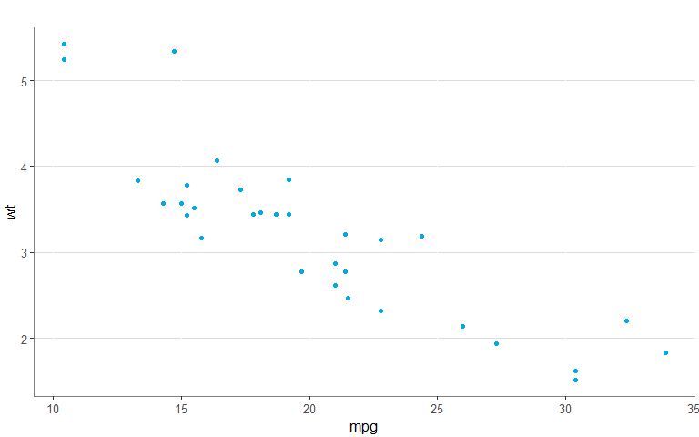

 

## Description

This package does variety of things I find useful when working with R
Tidyverse:

-   Import commonly used packages
-   Changes the default ggplot theme
-   Overrides dplyr::summarise to remove grouping
-   Contains various functions for use with ggplot
-   Contains various functions for use in tidy code

 

## ggplot theme

<!-- -->

 

## ggplot functions

-   `gg_regression_line` : Plots a regression line

-   `gg_loess_line` : Plots a loess regression line

-   `gg_legend_remove` : Removes the legend

-   `gg_legend_notitle` : Removes the legend title

-   `gg_legend_bottom` : Moves the legend to the bottom of the plot

-   `gg_y_percent` : Changes the y-axis to percentage

-   `gg_y_big` : Changes the y-axis to avoid scientific notation for big
    numbers

-   `gg_y_zero` : Changes the y-axis to start at 0

-   `gg_y_remove` : Removes the y-axis

-   `gg_x_wrap` : Wraps text on x-axis labels

-   `gg_x_rotate` : Rotates x-axis labels 45°

-   `gg_x_remove` : Removes the x-axis

 

## General functions

-   `%notin%` : As `%in%` but exclusionary

-   `d` : Formats table (using `gt` as base)

<table class="gt_table">
  
  <thead class="gt_col_headings">
    <tr>
      <th class="gt_col_heading gt_columns_bottom_border gt_left" rowspan="1" colspan="1">Sepal.Length</th>
      <th class="gt_col_heading gt_columns_bottom_border gt_left" rowspan="1" colspan="1">Sepal.Width</th>
      <th class="gt_col_heading gt_columns_bottom_border gt_left" rowspan="1" colspan="1">Petal.Length</th>
      <th class="gt_col_heading gt_columns_bottom_border gt_left" rowspan="1" colspan="1">Petal.Width</th>
      <th class="gt_col_heading gt_columns_bottom_border gt_left" rowspan="1" colspan="1">Species</th>
    </tr>
  </thead>
  <tbody class="gt_table_body">
    <tr><td class="gt_row gt_left">5.1</td>
<td class="gt_row gt_left">3.5</td>
<td class="gt_row gt_left">1.4</td>
<td class="gt_row gt_left">0.2</td>
<td class="gt_row gt_left">setosa</td></tr>
    <tr><td class="gt_row gt_left">4.9</td>
<td class="gt_row gt_left">3.0</td>
<td class="gt_row gt_left">1.4</td>
<td class="gt_row gt_left">0.2</td>
<td class="gt_row gt_left">setosa</td></tr>
    <tr><td class="gt_row gt_left">4.7</td>
<td class="gt_row gt_left">3.2</td>
<td class="gt_row gt_left">1.3</td>
<td class="gt_row gt_left">0.2</td>
<td class="gt_row gt_left">setosa</td></tr>
    <tr><td class="gt_row gt_left">4.6</td>
<td class="gt_row gt_left">3.1</td>
<td class="gt_row gt_left">1.5</td>
<td class="gt_row gt_left">0.2</td>
<td class="gt_row gt_left">setosa</td></tr>
    <tr><td class="gt_row gt_left">5.0</td>
<td class="gt_row gt_left">3.6</td>
<td class="gt_row gt_left">1.4</td>
<td class="gt_row gt_left">0.2</td>
<td class="gt_row gt_left">setosa</td></tr>
    <tr><td class="gt_row gt_left">5.4</td>
<td class="gt_row gt_left">3.9</td>
<td class="gt_row gt_left">1.7</td>
<td class="gt_row gt_left">0.4</td>
<td class="gt_row gt_left">setosa</td></tr>
  </tbody>
  
  
</table>

-   `filter_dupes` : selects duplicated rows

<!-- -->

    ## # A tibble: 5 x 12
    ## # Groups:   wt [2]
    ##     mpg   cyl  disp    hp  drat    wt  qsec    vs    am  gear  carb     n
    ##   <dbl> <dbl> <dbl> <dbl> <dbl> <dbl> <dbl> <dbl> <dbl> <dbl> <dbl> <int>
    ## 1  18.7     8  360    175  3.15  3.44  17.0     0     0     3     2     3
    ## 2  19.2     6  168.   123  3.92  3.44  18.3     1     0     4     4     3
    ## 3  17.8     6  168.   123  3.92  3.44  18.9     1     0     4     4     3
    ## 4  14.3     8  360    245  3.21  3.57  15.8     0     0     3     4     2
    ## 5  15       8  301    335  3.54  3.57  14.6     0     1     5     8     2

-   `fix_names` : Changes the column names tidy style

<!-- -->

    ##     sepal_length sepal_width petal_length petal_width    species
    ## 1            5.1         3.5          1.4         0.2     setosa
    ## 2            4.9         3.0          1.4         0.2     setosa
    ## 3            4.7         3.2          1.3         0.2     setosa
    ## 4            4.6         3.1          1.5         0.2     setosa
    ## 5            5.0         3.6          1.4         0.2     setosa
    ## 6            5.4         3.9          1.7         0.4     setosa
    ## 7            4.6         3.4          1.4         0.3     setosa
    ## 8            5.0         3.4          1.5         0.2     setosa
    ## 9            4.4         2.9          1.4         0.2     setosa
    ## 10           4.9         3.1          1.5         0.1     setosa
    ## 11           5.4         3.7          1.5         0.2     setosa
    ## 12           4.8         3.4          1.6         0.2     setosa
    ## 13           4.8         3.0          1.4         0.1     setosa
    ## 14           4.3         3.0          1.1         0.1     setosa
    ## 15           5.8         4.0          1.2         0.2     setosa
    ## 16           5.7         4.4          1.5         0.4     setosa
    ## 17           5.4         3.9          1.3         0.4     setosa
    ## 18           5.1         3.5          1.4         0.3     setosa
    ## 19           5.7         3.8          1.7         0.3     setosa
    ## 20           5.1         3.8          1.5         0.3     setosa
    ## 21           5.4         3.4          1.7         0.2     setosa
    ## 22           5.1         3.7          1.5         0.4     setosa
    ## 23           4.6         3.6          1.0         0.2     setosa
    ## 24           5.1         3.3          1.7         0.5     setosa
    ## 25           4.8         3.4          1.9         0.2     setosa
    ## 26           5.0         3.0          1.6         0.2     setosa
    ## 27           5.0         3.4          1.6         0.4     setosa
    ## 28           5.2         3.5          1.5         0.2     setosa
    ## 29           5.2         3.4          1.4         0.2     setosa
    ## 30           4.7         3.2          1.6         0.2     setosa
    ## 31           4.8         3.1          1.6         0.2     setosa
    ## 32           5.4         3.4          1.5         0.4     setosa
    ## 33           5.2         4.1          1.5         0.1     setosa
    ## 34           5.5         4.2          1.4         0.2     setosa
    ## 35           4.9         3.1          1.5         0.2     setosa
    ## 36           5.0         3.2          1.2         0.2     setosa
    ## 37           5.5         3.5          1.3         0.2     setosa
    ## 38           4.9         3.6          1.4         0.1     setosa
    ## 39           4.4         3.0          1.3         0.2     setosa
    ## 40           5.1         3.4          1.5         0.2     setosa
    ## 41           5.0         3.5          1.3         0.3     setosa
    ## 42           4.5         2.3          1.3         0.3     setosa
    ## 43           4.4         3.2          1.3         0.2     setosa
    ## 44           5.0         3.5          1.6         0.6     setosa
    ## 45           5.1         3.8          1.9         0.4     setosa
    ## 46           4.8         3.0          1.4         0.3     setosa
    ## 47           5.1         3.8          1.6         0.2     setosa
    ## 48           4.6         3.2          1.4         0.2     setosa
    ## 49           5.3         3.7          1.5         0.2     setosa
    ## 50           5.0         3.3          1.4         0.2     setosa
    ## 51           7.0         3.2          4.7         1.4 versicolor
    ## 52           6.4         3.2          4.5         1.5 versicolor
    ## 53           6.9         3.1          4.9         1.5 versicolor
    ## 54           5.5         2.3          4.0         1.3 versicolor
    ## 55           6.5         2.8          4.6         1.5 versicolor
    ## 56           5.7         2.8          4.5         1.3 versicolor
    ## 57           6.3         3.3          4.7         1.6 versicolor
    ## 58           4.9         2.4          3.3         1.0 versicolor
    ## 59           6.6         2.9          4.6         1.3 versicolor
    ## 60           5.2         2.7          3.9         1.4 versicolor
    ## 61           5.0         2.0          3.5         1.0 versicolor
    ## 62           5.9         3.0          4.2         1.5 versicolor
    ## 63           6.0         2.2          4.0         1.0 versicolor
    ## 64           6.1         2.9          4.7         1.4 versicolor
    ## 65           5.6         2.9          3.6         1.3 versicolor
    ## 66           6.7         3.1          4.4         1.4 versicolor
    ## 67           5.6         3.0          4.5         1.5 versicolor
    ## 68           5.8         2.7          4.1         1.0 versicolor
    ## 69           6.2         2.2          4.5         1.5 versicolor
    ## 70           5.6         2.5          3.9         1.1 versicolor
    ## 71           5.9         3.2          4.8         1.8 versicolor
    ## 72           6.1         2.8          4.0         1.3 versicolor
    ## 73           6.3         2.5          4.9         1.5 versicolor
    ## 74           6.1         2.8          4.7         1.2 versicolor
    ## 75           6.4         2.9          4.3         1.3 versicolor
    ## 76           6.6         3.0          4.4         1.4 versicolor
    ## 77           6.8         2.8          4.8         1.4 versicolor
    ## 78           6.7         3.0          5.0         1.7 versicolor
    ## 79           6.0         2.9          4.5         1.5 versicolor
    ## 80           5.7         2.6          3.5         1.0 versicolor
    ## 81           5.5         2.4          3.8         1.1 versicolor
    ## 82           5.5         2.4          3.7         1.0 versicolor
    ## 83           5.8         2.7          3.9         1.2 versicolor
    ## 84           6.0         2.7          5.1         1.6 versicolor
    ## 85           5.4         3.0          4.5         1.5 versicolor
    ## 86           6.0         3.4          4.5         1.6 versicolor
    ## 87           6.7         3.1          4.7         1.5 versicolor
    ## 88           6.3         2.3          4.4         1.3 versicolor
    ## 89           5.6         3.0          4.1         1.3 versicolor
    ## 90           5.5         2.5          4.0         1.3 versicolor
    ## 91           5.5         2.6          4.4         1.2 versicolor
    ## 92           6.1         3.0          4.6         1.4 versicolor
    ## 93           5.8         2.6          4.0         1.2 versicolor
    ## 94           5.0         2.3          3.3         1.0 versicolor
    ## 95           5.6         2.7          4.2         1.3 versicolor
    ## 96           5.7         3.0          4.2         1.2 versicolor
    ## 97           5.7         2.9          4.2         1.3 versicolor
    ## 98           6.2         2.9          4.3         1.3 versicolor
    ## 99           5.1         2.5          3.0         1.1 versicolor
    ## 100          5.7         2.8          4.1         1.3 versicolor
    ## 101          6.3         3.3          6.0         2.5  virginica
    ## 102          5.8         2.7          5.1         1.9  virginica
    ## 103          7.1         3.0          5.9         2.1  virginica
    ## 104          6.3         2.9          5.6         1.8  virginica
    ## 105          6.5         3.0          5.8         2.2  virginica
    ## 106          7.6         3.0          6.6         2.1  virginica
    ## 107          4.9         2.5          4.5         1.7  virginica
    ## 108          7.3         2.9          6.3         1.8  virginica
    ## 109          6.7         2.5          5.8         1.8  virginica
    ## 110          7.2         3.6          6.1         2.5  virginica
    ## 111          6.5         3.2          5.1         2.0  virginica
    ## 112          6.4         2.7          5.3         1.9  virginica
    ## 113          6.8         3.0          5.5         2.1  virginica
    ## 114          5.7         2.5          5.0         2.0  virginica
    ## 115          5.8         2.8          5.1         2.4  virginica
    ## 116          6.4         3.2          5.3         2.3  virginica
    ## 117          6.5         3.0          5.5         1.8  virginica
    ## 118          7.7         3.8          6.7         2.2  virginica
    ## 119          7.7         2.6          6.9         2.3  virginica
    ## 120          6.0         2.2          5.0         1.5  virginica
    ## 121          6.9         3.2          5.7         2.3  virginica
    ## 122          5.6         2.8          4.9         2.0  virginica
    ## 123          7.7         2.8          6.7         2.0  virginica
    ## 124          6.3         2.7          4.9         1.8  virginica
    ## 125          6.7         3.3          5.7         2.1  virginica
    ## 126          7.2         3.2          6.0         1.8  virginica
    ## 127          6.2         2.8          4.8         1.8  virginica
    ## 128          6.1         3.0          4.9         1.8  virginica
    ## 129          6.4         2.8          5.6         2.1  virginica
    ## 130          7.2         3.0          5.8         1.6  virginica
    ## 131          7.4         2.8          6.1         1.9  virginica
    ## 132          7.9         3.8          6.4         2.0  virginica
    ## 133          6.4         2.8          5.6         2.2  virginica
    ## 134          6.3         2.8          5.1         1.5  virginica
    ## 135          6.1         2.6          5.6         1.4  virginica
    ## 136          7.7         3.0          6.1         2.3  virginica
    ## 137          6.3         3.4          5.6         2.4  virginica
    ## 138          6.4         3.1          5.5         1.8  virginica
    ## 139          6.0         3.0          4.8         1.8  virginica
    ## 140          6.9         3.1          5.4         2.1  virginica
    ## 141          6.7         3.1          5.6         2.4  virginica
    ## 142          6.9         3.1          5.1         2.3  virginica
    ## 143          5.8         2.7          5.1         1.9  virginica
    ## 144          6.8         3.2          5.9         2.3  virginica
    ## 145          6.7         3.3          5.7         2.5  virginica
    ## 146          6.7         3.0          5.2         2.3  virginica
    ## 147          6.3         2.5          5.0         1.9  virginica
    ## 148          6.5         3.0          5.2         2.0  virginica
    ## 149          6.2         3.4          5.4         2.3  virginica
    ## 150          5.9         3.0          5.1         1.8  virginica

-   `left_join0` : Performs a left_join, while setting values in missing
    rows to 0 instead of NA.

<!-- -->

    ## # A tibble: 3 x 3
    ##      id    v1    v2
    ##   <dbl> <dbl> <dbl>
    ## 1     1     2     2
    ## 2     2     2    NA
    ## 3     3    10     4

 

    ## # A tibble: 3 x 3
    ##      id    v1    v2
    ##   <dbl> <dbl> <dbl>
    ## 1     1     2     2
    ## 2     2     2     0
    ## 3     3    10     4

-   `percent` : Returns proportion formatted as percentage

<!-- -->

    ## [1] "17.3%"

-   `rows` : Facilitates looping

<!-- -->

    ## [1] 21
    ## [1] 21
    ## [1] 22.8
    ## [1] 21.4
    ## [1] 18.7
    ## [1] 18.1

-   `summarise` : Overrides the standard summarise function, so that
    grouping is dropped after

<!-- -->

    ## [1] "am"

 

    ## character(0)

-   `tab` : Ordered `count` including percentage

<!-- -->

    ##      species  n percent
    ## 1     setosa 50   33.3%
    ## 2 versicolor 50   33.3%
    ## 3  virginica 50   33.3%

 

## Imported packages

-   tidyverse
-   ggbeeswarm
-   glue
-   gt
-   magrittr
-   patchwork
-   readxl
-   stringr
