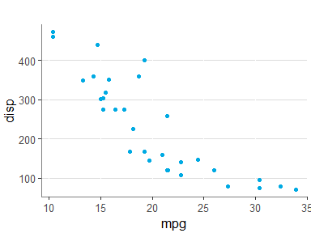

<!-- README.md is generated from README.Rmd. Please edit that file -->

# jsmp

<br>

## Description

This package does variety of things I find useful when working with R
Tidyverse:

-   Import commonly used packages
-   Changes the default ggplot theme
-   Overrides dplyr::summarise to remove grouping
-   Contains various functions for use with ggplot
-   Contains various functions for use in tidy code

<br>

## Custom ggplot theme

<!-- -->

<br>

## ggplot functions

-   `gg_regression_line` : Plots a regression line

-   `gg_loess_line` : Plots a loess regression line

-   `gg_legend_remove` : Removes the legend

-   `gg_legend_notitle` : Removes the legend title

-   `gg_legend_bottom` : Moves the legend to the bottom of the plot

-   `gg_y_percent` : Changes the y-axis to percentage

-   `gg_y_big` : Changes the y-axis to avoid scientific notation for big
    numbers

-   `gg_y_zero` : Changes the y-axis to start at 0

-   `gg_y_remove` : Removes the y-axis

-   `gg_x_wrap` : Wraps text on x-axis labels

-   `gg_x_rotate` : Rotates x-axis labels 45°

-   `gg_x_remove` : Removes the x-axis

<br>

## General functions

-   `%notin%` : As `%in%` but exclusionary

-   `d` : Formats table (using `gt` as base)

-   `filter_dupes` : selects duplicated rows

``` r
mtcars %>% filter_dupes("wt")
```

    #> # A tibble: 5 x 12
    #> # Groups:   wt [2]
    #>     mpg   cyl  disp    hp  drat    wt  qsec    vs    am  gear  carb     n
    #>   <dbl> <dbl> <dbl> <dbl> <dbl> <dbl> <dbl> <dbl> <dbl> <dbl> <dbl> <int>
    #> 1  18.7     8  360    175  3.15  3.44  17.0     0     0     3     2     3
    #> 2  19.2     6  168.   123  3.92  3.44  18.3     1     0     4     4     3
    #> 3  17.8     6  168.   123  3.92  3.44  18.9     1     0     4     4     3
    #> 4  14.3     8  360    245  3.21  3.57  15.8     0     0     3     4     2
    #> 5  15       8  301    335  3.54  3.57  14.6     0     1     5     8     2

-   `fix_names` : Changes the column names tidy style

``` r
iris %>% fix_names() %>% 
   head()
```

    #>   sepal_length sepal_width petal_length petal_width species
    #> 1          5.1         3.5          1.4         0.2  setosa
    #> 2          4.9         3.0          1.4         0.2  setosa
    #> 3          4.7         3.2          1.3         0.2  setosa
    #> 4          4.6         3.1          1.5         0.2  setosa
    #> 5          5.0         3.6          1.4         0.2  setosa
    #> 6          5.4         3.9          1.7         0.4  setosa

-   `left_join0` : Performs a left_join, while setting values in missing
    rows to 0 instead of NA.

``` r
df1 <- tribble(
   ~id, ~v1,
   1, 2,
   2, 2,
   3, 10)

df2 <- tribble(
   ~id, ~v2,
   1, 2,
   3, 4)

left_join(df1, df2)
```

    #> # A tibble: 3 x 3
    #>      id    v1    v2
    #>   <dbl> <dbl> <dbl>
    #> 1     1     2     2
    #> 2     2     2    NA
    #> 3     3    10     4

<br>

``` r
left_join0(df1, df2)
```

    #> # A tibble: 3 x 3
    #>      id    v1    v2
    #>   <dbl> <dbl> <dbl>
    #> 1     1     2     2
    #> 2     2     2     0
    #> 3     3    10     4

-   `percent` : Returns proportion formatted as percentage

``` r
percent(0.173234235)
```

    #> [1] "17.3%"

-   `rows` : Facilitates looping

``` r
df <- mtcars %>% head()
for (row in rows(df)){
   print(row$mpg)
}
```

    #> [1] 21
    #> [1] 21
    #> [1] 22.8
    #> [1] 21.4
    #> [1] 18.7
    #> [1] 18.1

-   `summarise` : Overrides the standard summarise function, so that
    grouping is dropped after

``` r
mtcars %>% 
   group_by(am, gear) %>% 
   dplyr::summarise(mean_mpg = mean(mpg)) %>% 
   group_vars()
```

    #> [1] "am"

<br>

``` r
mtcars %>% 
   group_by(am, gear) %>% 
   summarise(mean_mpg = mean(mpg)) %>% 
   group_vars()
```

    #> character(0)

-   `tab` : Ordered `count` including percentage

``` r
iris %>% 
   fix_names() %>% 
   tab(species)
```

    #>      species  n percent
    #> 1     setosa 50   33.3%
    #> 2 versicolor 50   33.3%
    #> 3  virginica 50   33.3%

<br>

## Imported packages

-   tidyverse
-   ggbeeswarm
-   glue
-   gt
-   magrittr
-   patchwork
-   readxl
-   stringr
